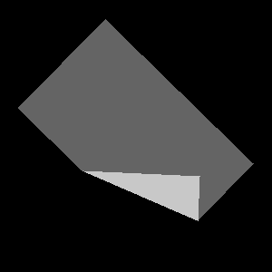

# alma-dataset/folding



## ALMA WP7 Folding @ https://zenodo.org/records/14864393

- <https://doi.org/10.5281/zenodo.14864392>

## cloth2d.py

Dependency:

- `pygame`

Parameters (and default values):

- `NUM_OUTPUT_SAMPLES` = 10000
- `IMAGE_SIZE` = (300, 300)
- `CLOTH_SIZE` = (250, 150) # Before applying scaling (transformations are optional).
- `CLOTH_TL` = (25, 75) # TL is the top left corner before applying scaling/rotation (transformations are optional).
- `RANDOM_SCALE_MAX` = 0.25 # Scaling, shrinking random variation (do not apply expansion
because it would go outside the image). Set to 0 for False.
- `RANDOM_ROTATE` = True # Rotation; if True, apply random 0-360 degrees.

Output:

- `NUM_OUTPUT_SAMPLES` images (grayscale emulating simplified 2.5D heights, rectangular fabric
with a single fold that always starts from adjacent sides).
- A single `labels.txt` file in plain text where each line is `image name.png, pick x, pick y, place x, place y`.

## cloth2d_vis.py

Dependency:

- `pygame`

Usage:

```bash
cloth2d_vis.py image_name pick_x pick_y place_x place_y
```

Example:

```bash
cloth2d_vis.py dataset/image1.png 1 2 3 4
```
